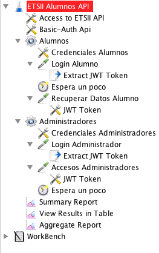

  

# iseP4JMeter
Código para el ejercicio de JMeter Práctica 4

El ejercicio consiste en realizar una prueba de carga de una API Rest empleando JMeter. 

La API se ha desarrollado empleando: 
* MongoDB
* NodeJS 
* Express 

El código se encuentra en el repositorio para su revisión por el alumno en caso de interés. Su desarrollo queda fuera del ámbito de esta asignatura. 

El servidor se distribuye en forma de una aplicación de contenedores Docker sobre Compose. Ambas aplicaciones deben estar instaladas para ejecutar el servidor: 
  * Docker Engine: https://docs.docker.com/engine/install/ubuntu/#install-using-the-repository
  

Tras descargar el código, situarse en el directorio principal (al mismo nivel del archivo docker-compose.yml y ejecutar: 
> docker compose up 
  
Para parar la aplicación ejecutar: 
> docker compose down 
  
Docker descargará las imágenes base y construirá las nuevas imagenes para al aplicacion. 

Accediendo con un navegador a http://\<IPDockerContainer>:3000 (ej.- http://localhost:3000) se  presenta la descripción básica de la api. Se tratan de dos métodos: 
* /auth/login: Permite identificarse al usuario como Alumno o Administrador. El acceso a este servicio está protegido por Http BasicAuth. Una vez autenticado, se obtiene un [JWT](https://jwt.io) Token para ser empleado en el servicio de alumno. 
* /alumnos/alumno: Devuelve el registro de calificaciones del alumno. Los administradores pueden consultar los datos de cualquier alumno. Los alumnos solo los propios. Se debe proporcionar un JWT válido (obtenido en el login) que portará la identidad (autenticación) y rol (autorización) del usuario. 

El proceso de consulta es el siguiente: 
1. Identificarse en el servicio de login proporcionando credenciales de válidas de alumno o administrador. Obteniendo un token. 
2. Solicitar los datos del propio alumno identificado (alumno) o de un grupo de alumnos (administrador). 

Para una prueba más detallada de que el entorno funciona, instala [curl](https://curl.haxx.se) y ejecuta el script: 
> pruebaEntorno.sh

Este script contiene la secuencia descrita anteriormente en invocaciones a curl, por lo que describe las operaciones a realizar. La primera línea contiene la variable SERVER. Debe definirse a la IP donde corre el contenedor de Docker. Si todo está correctamente configurado, obtendrá el perfil de un alumno, como el ejemplo siguiente: 

```json
{
   "_id": "5cdfd96c6731c5f7bc5b552d",
   "nombre": "Mari",
   "apellidos": "Fletcher Weiss",
   "sexo": "female",
   "email": "mariweiss@tropoli.com",
   "fechaNacimiento": "1992-04-04T00:00:00.000Z",
   "comentarios": "Aliquip dolor laboris ullamco id ex labore. Ipsum eiusmod ut aliquip non cillum deserunt sunt commodo anim ad nisi excepteur eu deserunt. Sit sunt proident Lorem irure irure minim adipisicing cillum. Nostrud officia in proident velit velit sit fugiat pariatur quis ad laboris minim dolor elit. Sint velit pariatur commodo sint veniam exercitation. Duis proident minim consequat consectetur sint et tempor labore culpa esse. Exercitation laborum non esse mollit tempor ea dolor minim adipisicing mollit in aliqua.\r\nUllamco adipisicing excepteur commodo sunt nulla quis sunt velit Lorem pariatur sunt ad do incididunt. In eu nostrud ullamco laboris eu minim. Consequat sit et eiusmod officia ex sit minim sit laborum quis laborum labore non. Dolor nulla ut pariatur reprehenderit minim dolore consequat sunt aliquip ipsum esse. Excepteur consequat fugiat elit et nisi dolore aute minim nostrud et.\r\n",
   "cursos": [
     {
       "curso": 1,
       "media": 5.2
     },
     {
       "curso": 2,
       "media": 9.1
     }
   ],
   "usuario": 10
}
```

Los datos de alumnos se han generado automáticamente empleando la herramienta [Json-Genrator](https://www.json-generator.com), con las plantillas situadas en /[mongodb/scripts](https://github.com/davidPalomar-ugr/iseP4JMeter/tree/master/mongodb):

> json-generator_administradores.json
>
> json-generator_alumnos.json

El subdirectorio [JMeter](https://github.com/davidPalomar-ugr/iseP4JMeter/tree/master/jMeter) contiene los archivos necesarios para realizar la sesión de prácticas: 
* alumnos.csv: Archivo con credenciales de alumnos
 * administradores.csv: Archivo con credenciales de administradores
 * apiAlumno.log: Log de accesso Http en formato apache. 
    
La prueba de JMeter debe: 
* Simular el acceso concurrente de un número de alumnos no menor a 10 y un número de administradores no menor de 3. 
* Parametrizar el "EndPoint" del servicio mediante variables para la dirección y puerto del servidor. Emplee "User Defined Variables" del Test Plan. 
* Definir globalmente las propiedades de los accesos Http y la Autenticacion Basic. Emplee HTTP Request Defatuls y HTTP Authorization Manager. 
* Los accesos de alumnos y administradores se modelarán con 2 Thread Groups independientes. La carga de accesos de administradores se modelará empleando el registro de accesos del archivo apiAlumno.log

La imagen siguiente presenta un posible diseño de la carga: 


